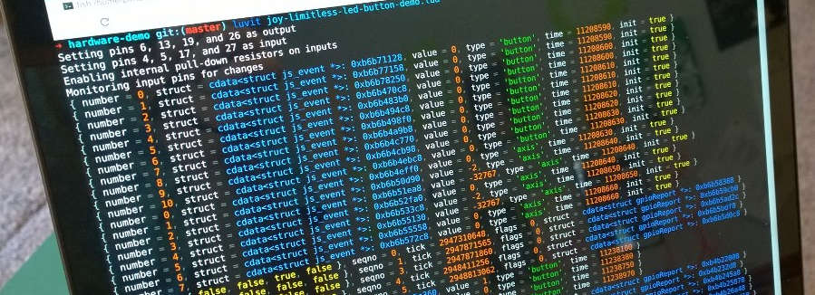
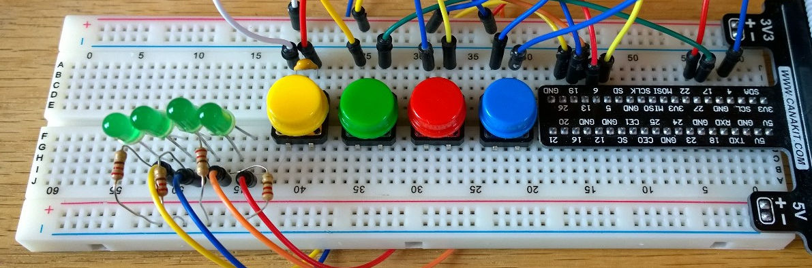
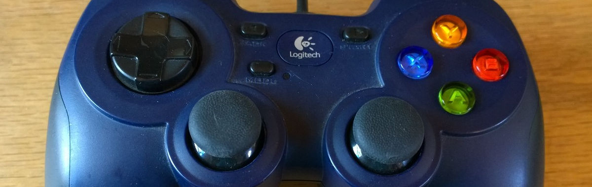

{ title = "Hardware Control",
  subtitle = "Romping in the Robot Revolution",
  author = {
    name = "Tim Caswell",
    email = "tim@creationix.com",
    twitter = "creationix",
    github = "creationix"
  },
  tags = { "hardware", "tutorial", "raspberry pi" },
  published = 1427336309
}

I've been learning all about embedded programming for the last few years.  I especially enjoy working with arduino style systems because of their simplicity.  I write some C code and run it directly without a pesky OS getting in the way and mucking up the gears.

But what about more powerful devices like the [Raspberry PI][]?  Their latest edition is powerful enough to run Linux, Android, or even the upcoming Windows 10!  But in price and size, it's pretty close to a typical microcontroller dev board.

[](https://vimeo.com/123232636)

*Click Image to see demo video.*

Luvit runs great on these devices and thanks to the low-level primitives in libuv combined with the raw access luajit's FFI provides, it's fairly trivial to access this low-level stuff from lua.

Source code can be found on github: <https://github.com/creationix/hardware-demo>

## Inputs and Outputs

The first order of business when starting a project like this is to enumerate the inputs and outputs and figure out how they will talk together.  For this project we had:

 - 4x Momentary Tactile Switches
 - 4x Green through-hole LEDs
 - USB Gamepad
 - 4x RGBW Limitless LED Lightbulbs.

We want button presses on the gamepad and tactile switches to trigger events in the output LEDs.

## Wires and Breadboard

Interfacing with the switches and small LEDs is obviously going to be easiest with a breadboard and using the Raspberry PIs GPIO (General Purpose Input Output) ports.



We use GPIO ports 4, 5, 17, and 27 for the button inputs using internal pull-down resistors through software and wiring the other end of the switches to 3v power.

The LEDs are wired to ports 6, 13, 19, and 26 with inline 220Ω resistors going to ground.

## Talking to the GPIO

There are many options for using the GPIO ports on the Raspberry PI, but in the end, I decided to use the pipe interface to [pigpio][].  This works really well with libuv since we can simply open the various pipes for reading and writing using the native I/O capabilities of luvit.

The one hitch I ran into was that I had to open the file descriptors using custom `open` flags.  I was saved by [LuaJit's FFI][] which is baked into luvit.  Using this I was able to open the pipes using non-buffered open with custom flags.

```lua
local uv = require('uv')
local ffi = require('ffi')
local C = ffi.C

ffi.cdef[[
  int open(const char *pathname, int flags);
]]

local O_WRONLY = uv.constants.O_WRONLY
local O_RDONLY = uv.constants.O_RDONLY

local function openPipe(path, flags)
  local fd = C.open(path, flags)
  assert(uv.guess_handle(fd) == 'pipe', 'problem opening pipe ' .. path)
  local handle = uv.new_pipe(false)
  assert(handle:open(fd))
  return handle
end
```

Once I have these handles, I can read and write the pipes like any normal libuv stream.

```lua
-- Writing to /dev/pigpio
local pigpio = openPipe("/dev/pigpio", O_WRONLY)
pigpio:write(data)

-- Reading from /dev/pigout
local pigout = openPipe("/dev/pigout", O_RDONLY)
pigout:read_start(function (err, data)
  -- Handle data
end)
```

### Sending `pigs` Commands

After that it's simply a matter of implementing a little coroutine sugar on top for requests and responses as well as learning the [pigs protocol][] to pigpio.

Full details can be seen in my tiny [pig driver][].

Usage looks like the following when running inside a coroutine:

```lua
-- Set pins 6, 13, 19, and 26 as output
req "m 6 w m 13 w m 19 w m 26 w"
-- Set pins 4, 5, 17, and 27 as input
req "m 4 r m 5 r m 17 r m 27 r"
-- Enable internal pull-down resistors on inputs
req "pud 4 d pud 5 d pud 17 d pud 27 d"
-- Turn on LEDs at 6 and 19
req "w 6 1 w 19 1"
-- Read state of buttons
local a, b, c, d = req "r 4 r 5 r 17 r 27"
```

### Waiting on GPIO changes

The other reason I chose [pigpio][] was because it has an event style mode where you can register interest in various gpio ports and be notified when they change state.  This is much better than polling for changes, especially when using tactile switches from a lua script.

First you create a notifier using the pigs command and then open the pipe it creates.  The command will return the index to the new notification pipe.

```lua
-- Creating the pipe
local index = req "no"
local pipe = openPipe("/dev/pigpio" .. index, true)

-- Tell pigs we want to watch pins 4, 5, 17, and 27
req("nb " .. index .. " " .. bit.bor(
  bit.lshift(1, 4),
  bit.lshift(1, 5),
  bit.lshift(1, 17),
  bit.lshift(1, 27)
))
```

Events in the pipe come as a series of 12 byte structs.  We can easily decode these using LuaJit's FFI.

```lua
ffi.cdef[[
  struct __attribute__ ((__packed__)) gpioReport {
    uint16_t seqno;
    uint16_t flags;
    uint32_t tick;
    uint32_t level;
  };
]]

pipe:read_start(function (err, data)
  assert(not err, err)
  -- Cast the string to a struct to parse the data.
  local events = ffi.cast("struct gpioReport*", data)
  -- We're only interested in the last event.
  local event = events + (#data / 12 - 1)
  p {
    seqno = struct.seqno,
    flags = struct.flags,
    tick = struct.tick,
    pins = {
      -- Read the pins values from the level property.
      bit.band(bit.rshift(struct.level, 4), 1) == 1,
      bit.band(bit.rshift(struct.level, 5), 1) == 1,
      bit.band(bit.rshift(struct.level, 17), 1) == 1,
      bit.band(bit.rshift(struct.level, 27), 1) == 1,
    }
  }
end)
```

In the library, I wrapped this up in a helper that also handles cleanup of the pipe when the general pig cleanup is called.

## Joy of the Joystick

Interfacing with the gamepad is considerably easier since the linux kernel exports it as a character device at `/dev/input/js0`.




We simply need to open this file using the filesystem interface and read 8 byte chunks as structs to get the events.  The struct is from the [kernel docs][].

```lua
local uv = require('uv')
local ffi = require('ffi')

ffi.cdef[[
  struct __attribute__ ((__packed__)) js_event {
    uint32_t time; /* event timestamp in milliseconds */
    int16_t value; /* value */
    uint8_t type; /* event type */
    uint8_t number; /* axis/button number */
  };
]]

local fd = uv.fs_open("/dev/input/js0", "r", 420)
uv.fs_read(fd, 8, -1, function (err, data)
  assert(not err, err)
  local struct = ffi.cast("struct js_event*", data)
  local event = {
    struct = struct,
    time = struct.time,
    number = struct.number,
    value = struct.value
  }
  if bit.band(struct.type, 0x80) > 0 then event.init = true end
  if bit.band(struct.type, 0x01) > 0 then event.type = "button" end
  if bit.band(struct.type, 0x02) > 0 then event.type = "axis" end
  -- TODO: handle event
end)
```

Again I added some coroutine sugar on top of this in the [joy driver][] and usage looks something like:

```lua
local read, close = makeJoy(0)
for event in read do
  p(event)
end
close()
```

## Setting the Mood

Interfacing with the Limitless LEDs was also pretty easy once I had the [protocol docs][] and the address to my wifi bridge.


```lua
local udp = uv.new_udp()
local bridgeHost = "192.168.1.110"
local bridgePort = 8899

-- Setting the lights Seafoam_Green
udp:send("\x42\x00\x55", bridgeHost, bridgePort)
udp:send("\x40\x50\x55", bridgeHost, bridgePort)

-- Turning the lights off
udp:send("\x41\x00\x55", bridgeHost, bridgePort)
```

## What's Next?

That's all for today.  My goal is to show that with enough information about the various interfaces available, libuv and ffi can prove a powerful combo to interfacing with about any device using nothing but lua code.  In this exercise we used:

 - libUV pipes (reading and writing)
 - libUV fs (reading)
 - libUV UDP (sending)
 - ffi.cast (parsing strings to structs)
 - ffi.C (calling C builtins like `open`)

Let me know what you think and give me ideas for our next exploration.

[Raspberry PI]: http://www.raspberrypi.org/
[pigpio]: http://abyz.co.uk/rpi/pigpio/
[pigs protocol]: http://abyz.co.uk/rpi/pigpio/pigs.html
[pig driver]: https://github.com/creationix/hardware-demo/blob/master/libs/pig.lua
[joy driver]: https://github.com/creationix/hardware-demo/blob/master/libs/joy.lua
[LuaJit's FFI]: http://luajit.org/ext_ffi.html
[protocol docs]: http://www.limitlessled.com/dev/
[kernel docs]: https://www.kernel.org/doc/Documentation/input/joystick-api.txt
