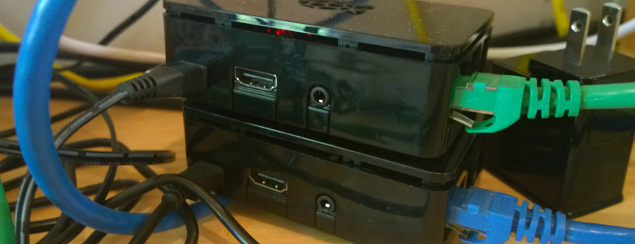
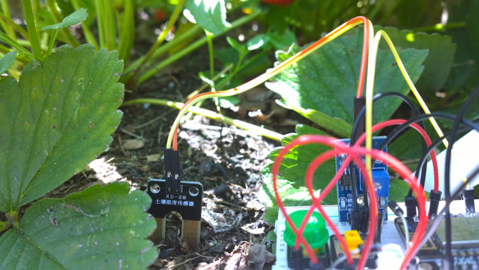
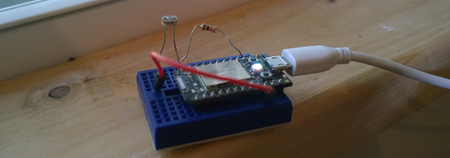
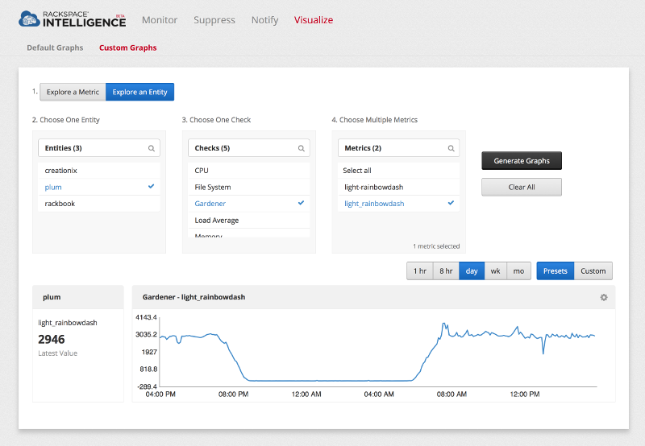

{ title = "IoT Sensor Relay",
  subtitle = "Monitoring the Real World",
  author = {
    name = "Tim Caswell",
    email = "tim@creationix.com",
    twitter = "creationix",
    github = "creationix"
  },
  tags = { "iot", "rackspace", "monitor", "sensor" },
}

As some of you know, I Joined Rackspace's monitoring team about 10 months ago.  They have been very gracious to let me spend large amounts of my work time building and maintaining Luvit. (Which is used in production by the monitoring agent.)

Recently I decided to try and find a way to incorporate this free monitoring service with my garden sensor project. I'm happy to report this actually works really well.  The key is to deploy a simple relay server somewhere on the LAN. I'm using a Raspberry PI in my home office. (These are also my luvi build boxes for armv6 and armv7.)



IoT sensors tend to be very low powered devices.  I've had most success recently with the [Particle](https://www.particle.io/) boards and the [Esp8266](http://www.esp8266.com/) chips.  The ESP chips are cheaper, but a little rougher on the edges.  Both of these feature 32-bit microcontrollers with WIFI capability built-in.

## Recording Sensor Data

Since I wish to eventually deploy several of these throughout my yard and run them on batteries, power use is a huge concern.  They can run as TCP servers or clients, but to be in an always listening state is a recipe for power drain.  It's better to deep-sleep most the time and wake up on some interval, measure the environment, and report the data to some other machine.



For now we'll assume there is some service running on the lan that accepts sensor data and records it for us.  This way the code in the microcontroller can be very simple and spend most it's time sleeping.



This microcontroller above is a Spark Core with a single LDR sensor measuring ambient light.  I wish to report this data to the relay server.

```c
if (client.connect(server, port)) {
  int light = analogRead(A0);
  String data = String("metric light_rainbowdash int ") + String(light, DEC) + "\n";
  client.print(data);
  delay(1000);
  client.stop();
  Spark.sleep(SLEEP_MODE_DEEP, 300);
}
```

## Relay Process

The monitoring agent works by polling the system on a schedule, not by listening for events to get pushed to it form the system.  This is obviously not a good match for the sensors that need to fire and forget their data to save their precious battery life.

We will create an in-between process using luvit that listens for data from the field and reports it to the agent on demand (listening two ways).

First we need to create a TCP server that listens for sensor reports from the field.  It will buffer this data in memory and wait for the agent to ask for it.

```lua
local createServer = require('coro-net').createServer

-- Listen for IPv4 connections on port 11000
local logs = {}
createServer({ host = "0.0.0.0", port = 11000 }, function (read, write, socket)

  -- Parse input into newline-delimited messages
  local buffer = ""
  for data in read do
    buffer = buffer .. data
    while true do
      -- Look for complete lines
      local line = buffer:match("^[^\n]*\n")
      -- Wait for more data if not.
      if not line then break end
      -- Move line from buffer to log list.
      buffer = buffer:sub(#line + 1)
      logs[#logs + 1] = line
    end
  end
  return write()

end)
```

What interface should we now expose to the monitoring agent?  At first I thought to use another TCP service, but it's fun to write agent plugins in shell.  TCP clients aren't easy in bash, but dumping the contents of a unix socket is trivially `cat /path/to/socket` or `socat - UNIX:/path/to/socket` depending on your OS.

To create the socket, we use the same `coro-net` library, but with a string path.

```lua
local path = "/var/run/gardener"
createServer(path, function (_, write)
  print("status requested")
  local report = "status OK\n" .. table.concat(logs)
  logs = {}
  print(report)
  write(report)
  write()
end)
```

## Deploy It!

I integrated this into the Rackspace system by creating an entity for my raspberry PI (named `plum`), and adding a new custom check that runs the `gardener` plugin.  The plugin itself contains:

```sh
#!/bin/sh
socat - UNIX:/var/run/gardener
```

The rackspace monitoring agent is also running on this machine.  When it connects it's told the schedule to poll the plugin.  It then reports the data up to the processing pipeline and we get a pretty graph showing data.  This particular metric is the light sensor on my office window-sill.  You can see the time the sun rises and sets.



I purposely left out some details to keep this readable.  If you wish to see the full source code with error handling and data validation, check out my [gardener project](https://github.com/creationix/gardener) on github.

If you have questions about the rackspace side of things like how exactly to create the entities and checks, I used the [raxmon tool](https://github.com/racker/rackspace-monitoring-cli).  Also the monitoring system has a fully featured alarms system that allows sending out emails or other alerts based on watches for certain conditions.  I could have a moisture sensor in my garden send me emails when it's time to water the garden, for example.

Happy hacking!
