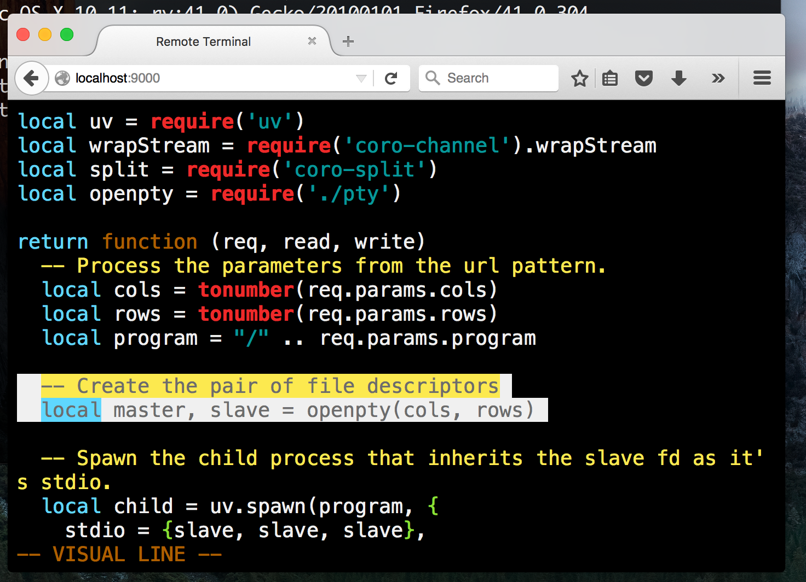

{ title = "Using FFI to make PTY",
  subtitle = "Remote Shells",
  author = {
    name = "Tim Caswell",
    email = "tim@creationix.com",
    twitter = "creationix",
    github = "creationix"
  },
  tags = { "tutorial", "libuv", "tty" },
  published = 1446764824
}

Some years ago I worked at [Cloud9 IDE][] and was tasked with implementing a
terminal in the browser.  The task is fairly basic and involves a few components.

 - A terminal emulator running in the browser.

 - A socket from the browser to the server.

 - A server that creates pseudo terminals on demand.


The first step is pretty complex, but there are several existing libraries that
handle this.  I've had good luck with [term.js][].  It's made for node.js and
socket.io, but will work anything that feeds it a data stream.

The second step is fairly simple.  For this article we'll be using plain
websockets.

The third step is tricky because Luvit doesn't provide an API for creating
pseudo terminals.  It's not part of libuv because implementing it in windows
is painful at best, and impossible to do cleanly.

## Creating Pseudo Terminals

On most [desktop](https://developer.apple.com/library/ios/documentation/System/Conceptual/ManPages_iPhoneOS/man3/openpty.3.html) [unix](https://www.freebsd.org/cgi/man.cgi?query=openpty) [systems](http://man7.org/linux/man-pages/man3/openpty.3.html), there is a system API known as `openpty()`.  It
looks something like this:

```c
int openpty(int *amaster, int *aslave, char *name,
            const struct termios *termp,
            const struct winsize *winp);
```

From the man page we read:

> The `openpty()` function finds an available pseudoterminal and returns
 file descriptors for the master and slave in `amaster` and `aslave`.  If
 `name` is not `NULL`, the filename of the slave is returned in `name`.  If
 `termp` is not `NULL`, the terminal parameters of the slave will be set
 to the values in `termp`.  If `winp` is not `NULL`, the window size of the
 slave will be set to the values in `winp`.

Once we have these two file descriptors, the built-in spawn and pipe APIs in
libuv can take us the rest of the way.

 - Create file descriptor pair using `openpty()`.

 - Create a `uv_pipe_t` and tell it to open the `amaster` fd.

 - Use `uv_spawn()` to create your child process and pass the `aslave` fd as
   it's stdio to inherit.

## It's all Lua

Thanks to the FFI interface in luajit, we can do this all from lua.

First we need to declare the interface to the system API we will be calling.

```lua
local ffi = require('ffi')
-- Define the bits of the system API we need.
ffi.cdef[[
  struct winsize {
      unsigned short ws_row;
      unsigned short ws_col;
      unsigned short ws_xpixel;   /* unused */
      unsigned short ws_ypixel;   /* unused */
  };
  int openpty(int *amaster, int *aslave, char *name,
              void *termp, /* unused so change to void to avoid defining struct */
              const struct winsize *winp);
]]
-- Load the system library that contains the symbol.
local util = ffi.load("util")
```

Now we can write a wrapper function to call it.

```lua
local function openpty(rows, cols)
  -- Lua doesn't have out-args so we create short arrays of numbers.
  local amaster = ffi.new("int[1]")
  local aslave = ffi.new("int[1]")
  local winp = ffi.new("struct winsize")
  winp.ws_row = rows
  winp.ws_col = cols
  util.openpty(amaster, aslave, nil, nil, winp)
  -- And later extract the single value that was placed in the array.
  return master[0], slave[0]
end
```

Calling into C from Lua isn't the prettiest thing, but it beats messing with
build systems and non-portable binaries.  As long as the API is stable across
the systems you care about, FFI is a great choice.

Also since it's core to the JIT engine itself, using FFI to call C libraries
results in a more optimized runtime.  Calling into the C binding API is a black
box and anything can happen.  But calling an FFI function has a clean declared
interface that's easier to optimize.

## The Webserver

We'll be using the weblit framework today to create the HTTP server complete
with static file serving and a websocket handler to stream the terminal data to
the browser.

```lua
-- Initialize the websocket subsystem
require('weblit-websocket')
-- Start declaring our server config
require('weblit-app')

-- It's bound to a local-only port for saftey.
.bind({
  host = "127.0.0.1",
  port = 9000
})

-- Add some useful middlewares to make it more HTTP compliant.
.use(require('weblit-logger'))
.use(require('weblit-auto-headers'))
.use(require('weblit-etag-cache'))

-- Serve our client app as static files.
.use(require('weblit-static')(module.dir .. "/www"))

-- Handle incoming websocket requests and route to the app module.
.websocket({
  path = "/:cols/:rows/:program:",
  protocol = "xterm"
}, require('./app'))

-- Start the server.
.start()
```

This is a pretty simple weblit app that serves a folder as static content
and handles a single websocket route.  The `cols`, `rows` and `program` variables
will be passed to the `app` handler as request parameters.

## The Socket Glue

And finally we implement the glue in the middle that accepts connections from
browsers, creates a pseudo terminal, spawns the requested process and pipes data
between the browser and the subprocess via the pty pair and the websocket
handle.

```lua
local uv = require('uv')
local wrapStream = require('coro-channel').wrapStream
local split = require('coro-split')

-- This file is `app.lua` so it's what the server is 
-- loading as the connection handler.
return function (req, read, write)
  -- Process the parameters from the url pattern.
  local cols = tonumber(req.params.cols)
  local rows = tonumber(req.params.rows)
  local program = "/" .. req.params.program

  -- Create the pair of file descriptors
  local master, slave = openpty(cols, rows)

  -- Spawn the child process that inherits the slave fd as it's stdio.
  local child = uv.spawn(program, {
    stdio = {slave, slave, slave},
    detached = true
  }, function (...)
    p("child exit", ...)
  end)

  -- Wrap the master fd in a uv pipe and then in a coro-stream.
  local pipe = uv.new_pipe(false)
  pipe:open(master)
  local cread, cwrite = wrapStream(pipe)

  -- Split runs two coroutines in parallel waiting for both to finish.
  split(function ()
    -- Pipe data from websocket to pty.
    for data in read do
      if data.opcode == 2 then
        cwrite(data.payload)
      end
    end
    cwrite()
  end, function ()
    -- Pipe data from pty to websocket
    for data in cread do
      write(data)
    end
    write()
  end)

  -- When both are done, clean up.
  child:close()
  pipe:close()
end
```

## The Browser Side

That's all there is to the luvit side of this example.  The browser is basically
a [term.js][] widget with a websocket connection to the luvit server that pipes
data between the terminal emulator and the websocket.

A fully runnable example can be found at <https://github.com/creationix/lshell>.



Vim in a browser, using WebSockets, served by Luvit!

[term.js]: https://github.com/chjj/term.js/
[Cloud9 IDE]: https://c9.io/
