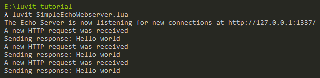

# A Non-Blocking Webserver

While the previous entries were mostly introducing important concepts, it's time to build something actually interesting: A webserver.

## Simplifying Asynchronous I/O

Before we do this, however, we should quickly revisit the previous script. Thankfully, the ``luvit`` executable includes a number of higher-level APIs to make  using the ``uv`` library easier. Let's first re-implement synchronous file system access using the ``fs`` library:

```lua title="LuvitReadFileSyncDemo.lua"
local fs = require("fs")

local TEXT_FILE_PATH = "HelloWorld.txt"

local fileContents = fs.readFileSync(TEXT_FILE_PATH)
print("File contents: ")
print(fileContents)
```

The main difference between this iteration and what we've built before is that we no longer need to rely on ``uv`` and its low-level interfaces. Instead, we can simply read from the file system with a single call, both synchronously and asynchronously - which is up next:

```lua title="LuvitReadFileAsyncDemo.lua"
local fs = require("fs")

local TEXT_FILE_PATH = "HelloWorld.txt"

local function onFileRead(errorMessage, fileContents)
    print("File contents: ")
    print(fileContents)
end

local fileContents = fs.readFile(TEXT_FILE_PATH, onFileRead)
```
As we can see, the code is significantly less complex. Underneath the hood it's still doing the exact same things, though (well, mostly). This includes all the details about the event loop and callbacks being scheduled for later, handled by ``libuv`` as we've already covered.

Just like in NodeJS, all of the APIs exist in two variants and are named identically except for the ``Sync`` postfix. Since ``libuv`` is at the heart of Luvit's APIs, the default version is always asynchronous; you'll have to actively opt in to blocking I/O when you need it.

## Networking Made Easy

Now, if we wanted to turn our application into a full-fledged webserver using nothing but ``uv``, we would be in for quite the ride. Sockets and networking in general are far from easy to do if restricted to working at a low level of abstraction, so we won't try that.

Luckily, we can rely on Luvit's ``http`` library to create a TCP-based HTTP server for us, using the ``net`` library (which we could also use directly, but won't for the aforementioned reason). The latter can be a powerful tool, but let's just create a basic HTTP server for now:

```lua title="SimpleEchoWebserver.lua"
local http = require("http")

local WEBSERVER_PORT = 1337
local WEBSERVER_HOST = "127.0.0.1"

local function onRequestReceived(request, response)

    print("A new HTTP request was received")

    local responseBody = "Hello world"
    response:setHeader("Content-Type", "text/plain")
    response:setHeader("Content-Length", #responseBody)
    response:finish(responseBody)

    print("Sending response: " .. responseBody)
end

local echoServer = http.createServer(onRequestReceived)
echoServer:listen(WEBSERVER_PORT, WEBSERVER_HOST)

print("The Echo Server is now listening for new connections at http://127.0.0.1:1337/")
```

To test the server, you can simply head to the address it was started on (``http://127.0.0.1:1337/``) in your browser and observe:



At this point, you are able to create arbitrarily complex applications using any of the Luvit standard libraries. But there's more!

## Packaging Your Application

Even though this simple webserver isn't very useful yet, we will turn it into a self-contained package and run it as an executable next.