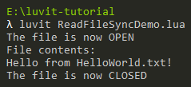

# Enter the Event Loop

Before we explore ``uv``, we should pause a moment and consider the different ways that we can access resources (like files or sockets).

## Blocking and Non-Blocking I/O

The most straightforward way is to request whatever operation we want to execute, wait until it is done, and then continue with our program. This is called **blocking**, because we cannot continue while tasks are pending, and it's very wasteful due to the fact that a lot of the time will be spent waiting. It doesn't mean our program is stuck, just that it can't proceed with the desired task until later.

**Non-blocking** programs are inherently better at utilizing the time we do have to wait, as we simply continue running our program and eventually will be notified via [callback functions](https://en.wikipedia.org/wiki/Callback_(computer_programming)). Once such a notification has occured, we do what we want to do with the resource we were trying to access. This approach is generally preferable, but has two drawbacks: It introduces some overhead for managing the callbacks, and it complicates the flow of execution, which makes the program code much harder to understand and reason about.

There's quite a bit more to it, though we don't really need to study all the details to proceed with this tutorial. You can read more on the [NodeJS website](https://nodejs.org/en/docs/guides/blocking-vs-non-blocking/). Since ``libuv`` was originally written for Node, many of the same concepts are shared between it and Luvit.

## The Asynchronous Event Loop

If you haven't guessed it by now, the reason that this is fundamental to understanding Luvit is because ``libuv`` is designed to support non-blocking requests, and will execute them asynchronously as part of its [event loop](https://en.wikipedia.org/wiki/Event_loop). You can learn more about how exactly this works from both the [libuv documentation](http://docs.libuv.org/en/v1.x/design.html) as well as the [NodeJS website](https://nodejs.org/en/docs/guides/event-loop-timers-and-nexttick/), but the most important part is that programs written for ``luvit`` will be wrapped in such an event loop, which fundamentally changes how code is executed behind the scenes.

Specifically, once your code has been executed ``luvit`` will automatically run the ``libuv`` event loop (by calling ``uv.run()`` at the end of the script). When this happens, ``libuv`` will handle all remaining tasks and then exit, returning control to your program. When writing synchronous code, this doesn't change anything as there won't be outstanding tasks and the event loop exits immediately, but otherwise the program will continue running while seeming "idle". This is *not* a [busy/wait](https://en.wikipedia.org/wiki/Busy_waiting), but rather [Asynchronous I/O](https://en.wikipedia.org/wiki/Asynchronous_I/O).

## Examples

Time for some examples to illustrate these different concepts! Let's create a new file containing some arbitrary text:

```lua title="HelloWorld.txt"
Hello from HelloWorld.txt!
```

We will now be reading this file both synchronously and asynchronously, using Luvit's ``uv`` library.

### Blocking I/O Using Standard Lua

Before doing so, quickly recall how we can read the text file using Lua's standard ``io`` library:

```lua title="ReadFileDemo.lua"
local TEXT_FILE_PATH = "HelloWorld.txt"

local file = io.open(TEXT_FILE_PATH, "r")
print("The file is now OPEN")

local fileContents = file:read("*all")
print("File contents: ")
print(fileContents)

file:close()
print("The file is now CLOSED")
```

These operations are always synchronous and therefore blocking, which makes the code easy to understand. Let's try using ``uv`` next.

### Blocking I/O Using libuv

To achieve the same result using ``uv``, we have to add some lower-level specifics and call the file system APIs like so:

```lua title="ReadFileSyncDemo.lua"
local uv = require("uv")

local TEXT_FILE_PATH = "HelloWorld.txt"

local MODE_READ_WRITE_EXECUTE = 438 -- 0666 as octets
local file = uv.fs_open(TEXT_FILE_PATH, "r", MODE_READ_WRITE_EXECUTE)
print("The file is now OPEN")

local lengthInBytes = string.len("Hello from HelloWorld.txt!")
local firstByteToRead = 0
local fileContents = uv.fs_read(file, lengthInBytes, firstByteToRead)
print("File contents: ")
print(fileContents)

uv.fs_close(file)
print("The file is now CLOSED")
```

This code isn't technically equivalent, as ``libuv`` does not abstract file system details like the ``mode`` or the number of bytes to read. We can safely ignore this, however, at least here in this tutorial. The resulting output is exactly the same and so is the flow of execution:




That's what one would expect, since we used *synchronous* I/O to read the file while blocking. But thanks to ``libuv``, we can do better.

### Non-Blocking I/O Using libuv

As a final demonstration, we will pass callbacks to ``libuv`` in order to read the file asynchronously:

```lua title="ReadFileAsyncDemo.lua"
local uv = require("uv")

local TEXT_FILE_PATH = "HelloWorld.txt"

local file

local function onFileClosed()
    print("Invoking onFileClosed callback")

    print("The file is now CLOSED")
end

local function onFileContentsRead(error, fileContents)
    print("Invoking onFileContentsRead callback")

    print("File contents: ")
    print(fileContents)

    uv.fs_close(file, onFileClosed)
    print("The asynchronous CLOSE operation is now queued")
end

local function onFileOpened(error, fileHandle)
    print("Invoking onFileOpened callback")

    print("The file is now OPEN")
    file = fileHandle
 
    local lengthInBytes = string.len("Hello from HelloWorld.txt!")
    local firstByteToRead = 0
    uv.fs_read(file, lengthInBytes, firstByteToRead, onFileContentsRead)

    print("The asynchronous READ operation is now queued")
end

local MODE_READ_WRITE_EXECUTE = 438 -- 0666 as octets
uv.fs_open(TEXT_FILE_PATH, "r", MODE_READ_WRITE_EXECUTE, onFileOpened)
print("The asynchronous OPEN operation is now queued")

print("The script has been executed (callbacks are still pending)")
```

Immediately it is obvious that the flow of execution is significantly more complicated in this example. However, what we can't see here is that the program could easily do other tasks while it's waiting for the operating system to do the work of reading from disk.

To better visualize this, a lot of unusually-verbose feedback has been added. The resulting output then is as follows:


The "interleaved" execution flow is a key property of asynchronous code, yielding a high degree of responsiveness in the non-blocking code. This is particularly critical in the domain of servers, where it allows a single process to handle many more requests. An alternative approach that also improves performance is [multithreading](https://en.wikipedia.org/wiki/Concurrent_computing), but this opens an entirely new can of worms by introducing difficult problems - from [race conditions](https://en.wikipedia.org/wiki/Race_condition) and [deadlocks](https://en.wikipedia.org/wiki/Deadlock) to memory consumption and processing overhead - that lead to scalability issues.

Unfortunately, both of these approaches cause a very significant increase in code complexity, making the flow harder to understand and debug. Lua's [coroutines](https://www.lua.org/pil/9.1.html) can be used to alleviate the "interleaved execution flow" issue, but this is a more advanced topic best left for another time. Instead, let's first see if we can't get rid of the low-level complexities that using the ``uv`` library introduced.

## Luvit APIs to the Rescue

As we've just seen, the ``uv`` library already provides us with all the functionality we need to perform both synchronous and asynchronous tasks. Unfortunately, it's a rather low-level interface and requires a significant amount of boilerplate code to do just about anything.

Since this isn't very convenient, Luvit ships with a set of high-level standard libraries that abstract away this functionality and build on it to provide easier-to-use interfaces. Now that we understand what Luvit does underneath the hood, we should make our life a bit easier.
