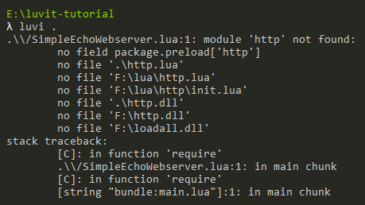
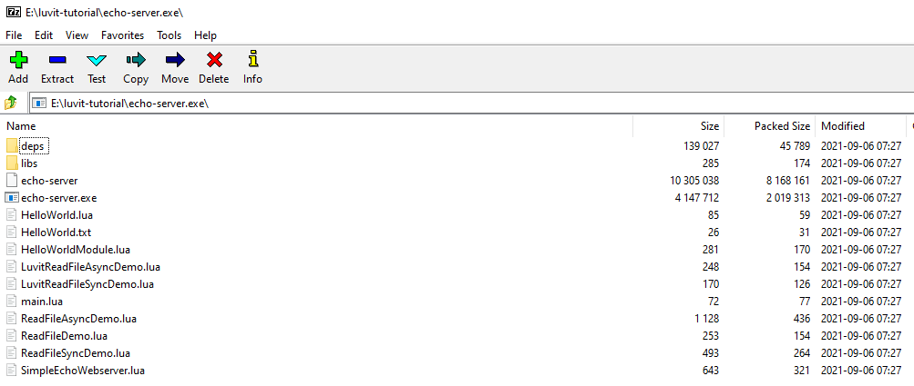

# Self-Contained Bundles

Until now, we've only used the ``luvit`` executable. The time has finally come to learn about the other tools we've downloaded earlier.

## Packaging the Echo Server

One problem we haven't yet solved: We are able to run the echo server on our system, but how do we get it to run on systems that don't have ``luvit`` installed? The answer is, packaging it into a self-contained bundle, which we can then turn into a proper binary.

Unlike compiled languages such as C or C++, Lua scripts can't simply be turned into machine code and run natively. Since they rely on a Lua interpreter to turn them into bytecode and execute that, we'll have to cheat a little: What we *can* do is bundle a Lua interpreter with our application and have it execute the scripts, just like it would when running ``luvit`` on the other machine. We'll use ``luvi`` for that.

There isn't really any drawback to that approach because Lua is extremely lightweight, so you wouldn't even know it's there.

## Creating a Luvi Bundle

Before we can actually use ``luvi``, we must understand a bit more about what it is and what it can (not) do. While ``luvit`` is the runtime we've used to execute the scripts on your own system, this interpretation is somewhat misleading: In reality, ``luvi`` is the Lua engine that runs all the scripts (and includes ``libuv``, bound via ``uv``). It just executes ``luvit`` as a special application - a so-called bundle.

A bundle in the Luvit ecosystem is simply a self-contained package following a predefined structure: It must have an entry point called ``main.lua`` and can be stored in either a folder or a compressed ``.zip`` archive (this is one reason why ``miniz`` is included inside ``luvi``).

To see how this works, let's quickly turn our echo HTTP server into a proper bundle by adding the entry point in the same directory:

```lua title="main.lua"
require("./SimpleEchoWebserver")
```

You can try running this via ``luvi .`` inside the same folder, or by giving the relative path if running from somewhere else. Go ahead and try this if you like. It should totally work... right? But wait! There's a problem:



What gives? It appears that the environment ``luvi`` provides isn't quite the same as the one our script encountered when run via  ``luvit``. We've already seen this back in [The Luvi Environment](/docs/tutorial/hello-world#the-luvi-environment), but it's quite easy to forget and very important, so it bears repeating!

## Luvi and Luvit Don't Get Along

There's a reason the ``fs`` and ``http`` libraries have been referred to as "Luvit APIs" in these pages. They're automatically included in ``luvit``, but ``luvi`` only contains the most fundamental low-level libraries (like ``jit``, ``openssl``, ``miniz`` and ``uv``). This means you can do ``require("uv")`` but ``luvi`` won't find ``http``, which is of course rather unfortunate considering we wanted to use it in our webserver.

One way to get around this problem is by manually downloading the ``http`` script and adding it to our bundle. *Or*, we could use ``lit``.

## Adding Luvit Packages to the Luvi Bundle

Lit is Luvit's package manager, and as such it can help us install packages. And it just so happens that ``http`` is available as such a package. We'll be able to include it in our bundle by typing the following in the folder that contains the bundle's entry point, ``main.lua``: 

> lit install luvit/http

After this command finished (hopefully successfully), a look inside the ``deps`` folder will show that it downloaded a whopping **19** files, including the ``http.lua`` package mentioned above. It's best not to think about this too hard - HTTP is difficult, after all.

When running ``luvi .`` again, surely it will now work... *or will it*? (Spoiler alert: It won't.) What are we missing, then?

### Require-ception

If we recall that [Luvit comes with a special ``require`` handler for resolving import paths](docs/tutorial/hello-world#relative-imports), this makes a lot more sense: ``luvi`` doesn't include this ``require`` handler as it's yet another Luvit package, which we will now install by making Lit download it, too:

> lit install luvit/require

After doing this, the ``deps`` folder includes a ``require.lua`` file, which containts the custom require handler we wanted to use. "Hold up a second", I can hear you say, "If we need this ``require`` package to ``require`` packages from the ``deps`` folder, then how on earth can we get the ``require`` itself from that folder?". The default Lua ``require`` definitely won't be able to do this; it doesn't look inside ``deps/``.

The answer, in this case, is "black magic" (or rather, adventurous design choices): ``luvi`` will automatically include it into a bundle whenever it finds a ``deps/require.lua`` file, and this will automatically replace Lua's standard ``require``.  *What could possibly go wrong?*

At long last, we're able to execute our echo server with ``luvi .``, only to see it promptly shut down without errors. What now?

### Manually Starting the Event Loop

What has happened is that our server has indeed been started; the TCP socket has been created and incoming connections would be accepted... if we hadn't forgotten to start the ``libuv`` event loop. In [The Asynchronous Event Loop](docs/tutorial/asynchronous-event-loop#the-asynchronous-event-loop) it was briefly mentioned that ``luvit`` automatically starts the event loop for us, by running ``uv.run()`` at the end. But ``luvi`` doesn't do that (and I've no idea why).

Since ``libuv`` handles the socket connection, but only when it's running the event loop, our script simply exited after initializing the server because ``uv`` wasn't there to pick up the slack. We never got to the part where socket connections are handled asynchronously.

Doing this is thankfully very simple, assuming we don't want to run the event loop with any specific parameters to control its behaviour (which we *could* do, if we cared to. But we don't). All we have to do is slightly modify the bundle's entry point to call ``uv.run()``:

```lua title="main.lua"
local uv = require("uv")

require("./SimpleEchoWebserver")

uv.run()
```

As a side note: Doing this has absolutely no (adverse) effect when running the script via ``luvit``. The loop only exits when there are no more scheduled tasks or callbacks, and in that case ``libuv`` simply won't do anything when ``luvit`` calls ``uv.run()`` for the second time.

When running the bundle through ``luvi .`` this time around, it will *finally* work as expected. So what do we do with this now?

## Creating a Standalone Version

Why, we want to create a standalone (binary) executable, of course! One that we can distribute. And we do, by simply typing this:

> luvi . --output echo-server.exe

That's for Windows, obviously. There's no need to call it ``echo-server.exe`` on Unix-based systems, as you can imagine.
Once this is done, we are free to run ``echo-server.exe`` (or ``./echo-server`` on Unix systems) and it will start our application. Isn't that great?

The result is that our self-contained bundle is zipped and combined with the ``luvi`` executable, and much like it would do when using the ``luvit`` bundle, it now runs our app inside its environment when started. You can actually open the executable in a zip program:



This particular example is using ``7zip`` on Windows, but it should work with any other standard ``zip`` utility, as well.

## Scripts and Packages and Bundles, Oh My

Since we've just created a self-containing executable, we could already deploy our application to other machines and run it as-is.

There are two remaining issues, though:

1. The zip archive contains every single file and folder from our directory, even those not actually needed by the ``main.lua`` script
2. Packaging apps as binary and distributing them is very inconvenient, particularly when multiple versions will inevitably exist

The first is due to ``luvi`` not really caring to figure out *what* should be bundled with our application, but rather handling the bundling process itself. And the second requires the use of a proper package managing tool, which is exactly what ``lit`` was made for.

In the next (and final) part of this tutorial, we'll be creating a Lit package that we can distribute and run anywhere we want.